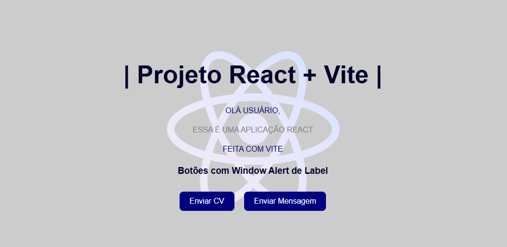

# 🚀 Projeto React + Vite

Este é um projeto simples desenvolvido com **React** e **Vite**, contendo componentes personalizados como `Button` e `ColoredTxt`. A aplicação exibe mensagens estilizadas e botões interativos.

## ✅ Tecnologias utilizadas

- [React](https://reactjs.org/)
- [Vite](https://vitejs.dev/)
- JavaScript (ES6+)
- CSS

## 🎯 Objetivo

Criar uma aplicação React utilizando Vite como bundler, com componentes reutilizáveis e estilizados, demonstrando uma estrutura básica de projeto front-end.

## 🧱 Estrutura do Projeto

```
src/
├── assets/
│   ├── react.svg
│   └── vite.svg
├── Components/
│   ├── Button/
│   │   └── button.jsx
│   └── Text/
│       └── ColoredTxt.jsx
├── App.css
├── App.jsx
└── main.jsx
```

## 🖥️ Como funciona

- `ColoredTxt`: Componente que recebe `text` e `color` como props, exibindo textos coloridos.
- `Button`: Componente que recebe `label` como prop, renderizando botões com textos variados.

## 📸 Demonstração



> A imagem acima representa a interface atual do projeto: mensagens personalizadas e dois botões com estilos padronizados sobre um fundo de logo do React.

## 🚀 Como executar o projeto

1. Clone o repositório:

```bash
git clone https://github.com/pamella-binotto/nome-do-repositorio.git
```

2. Instale as dependências:

```bash
npm install
```

3. Execute o projeto:

```bash
npm run dev
```

4. Acesse no navegador:

```
http://localhost:5173
```

## 🔧 Scripts disponíveis

- `npm run dev` – Executa a aplicação em modo desenvolvimento.
- `npm run build` – Compila a aplicação para produção.
- `npm run preview` – Visualiza a aplicação de produção localmente.


## 👩‍💻 Autora

- **Pamella Binotto** — [@pamella-binotto](https://github.com/pamella-binotto)
